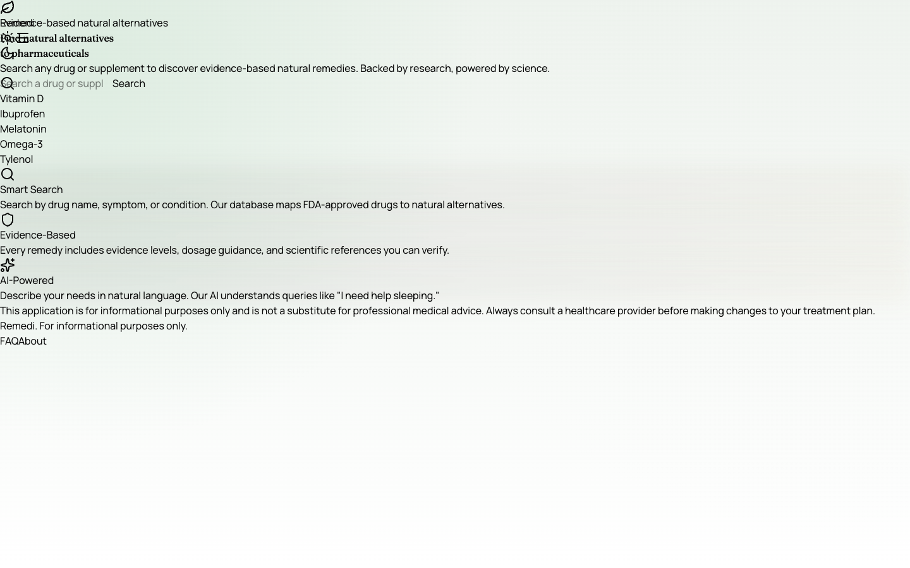

# Remedi


Search a pharmaceutical, get the natural remedies that are honestly related to
it, with the relationship labelled: **Alternative**, **Complementary** or
**Supportive**. Live at https://remedi-iota.vercel.app.

The interesting part is not the search; it is what the data is not allowed to
say. The seed set (85 drugs, 504 remedies, 249 mappings in
[`prisma/seed-data/mappings.ts`](prisma/seed-data/mappings.ts)) is held to
pharmacological invariants by
[`__tests__/seed-data/mappings.test.ts`](__tests__/seed-data/mappings.test.ts),
so a careless edit fails CI instead of shipping:

- Rescue inhalers, opioids, seizure medication, antibiotics, GLP-1s and
  hormonal contraceptives can never carry an "Alternative" label. Supportive
  entries are allowed; a substitute is a test failure.
- Anticoagulants and antiplatelets (warfarin, apixaban, rivaroxaban,
  dabigatran, clopidogrel) and quetiapine have **zero** mappings on purpose.
  Even a "supportive" supplement changes bleeding risk, so an empty page is the
  curated answer. The test pins the list both ways: those drugs must stay
  unmapped, and every other drug must have at least one displayable mapping,
  so emptiness is always a decision and never a gap.
- Magnesium is forbidden beside ciprofloxacin (divalent cations chelate
  fluoroquinolones and block absorption).

The same stance applies at runtime. If the interactions API fails (rate limit,
database blip), the remedy page renders an error. It used to fall through to
the empty state and say "no known interactions", which is the one wrong answer
a safety checker must never give ([#69](https://github.com/gr8monk3ys/remedi/pull/69)).



## Stack

Next.js 16 (App Router, React 19), TypeScript, Bun, Prisma 7 + PostgreSQL,
Tailwind 4, Clerk auth, Stripe, Resend, Sentry. OpenAI is optional and only
powers `/api/ai-search`.

## Run locally

```bash
git clone https://github.com/gr8monk3ys/remedi.git && cd remedi
bun install
cp .env.example .env            # defaults work for local dev
docker-compose up -d postgres   # Postgres on localhost:5433
bun run init                    # prisma generate + migrate + seed
bun run dev                     # http://localhost:3000
```

```bash
curl "http://localhost:3000/api/search?query=ibuprofen"
```

Search order: local database, then OpenFDA (results are cached back into the
database), then a small in-memory fallback. `OPENFDA_API_KEY` raises the FDA
rate limit from 40 to 240 requests/min. Set `bun run import:fda:dry` to preview
a bulk import; see [`docs/OPENFDA_IMPORT.md`](docs/OPENFDA_IMPORT.md).

## Check

```bash
bun run format:check && bun run lint && bun run type-check && bun run knip
bun run test:run        # vitest unit tests (__tests__/)
bun run test:e2e        # playwright (e2e/), needs the database
bun run db:verify && bun run db:integrity && bun run prod:check
```

All of the above run in `.github/workflows/ci.yml`; `test` and `e2e` are the
required checks on `main`.

## Layout

```
app/api/           search, remedy, interactions, favorites, contributions, admin, webhooks
lib/remedy-matcher.ts   token-overlap scoring; MIN_DISPLAY_SIMILARITY hides weak mappings
lib/openFDA.ts     FDA client with retry
lib/db/            all Prisma access
prisma/seed-data/  curated drugs, remedies and mappings
proxy.ts           CSP, CORS and auth-protected routes (Next middleware)
docs/              DEPLOYMENT.md, OPENFDA_IMPORT.md, PWA.md, SENTRY_ALERTS.md
```

## License

GPL-3.0, see [LICENSE](LICENSE).

## Disclaimer

Informational only, not medical advice. Talk to a physician or pharmacist before
changing any medication.
